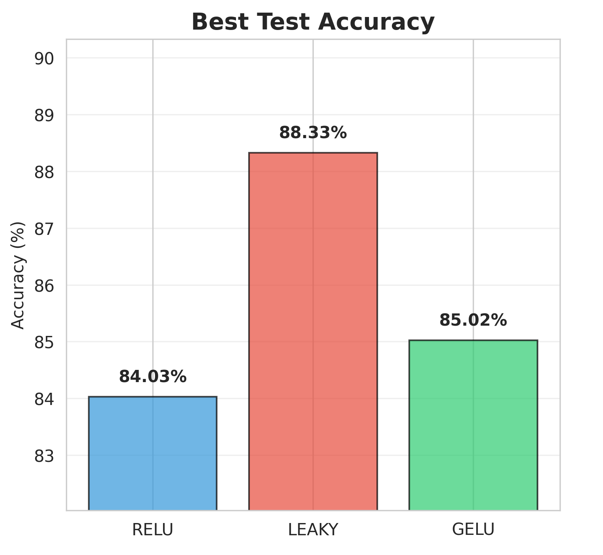
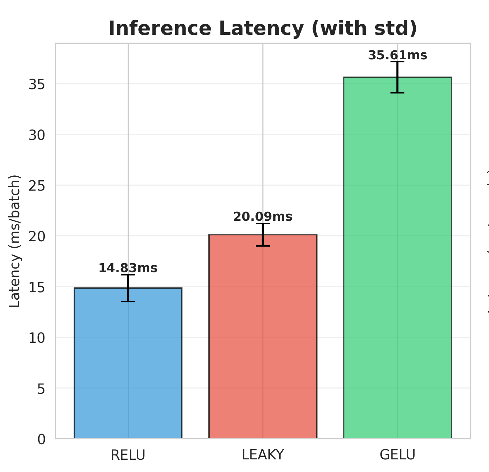
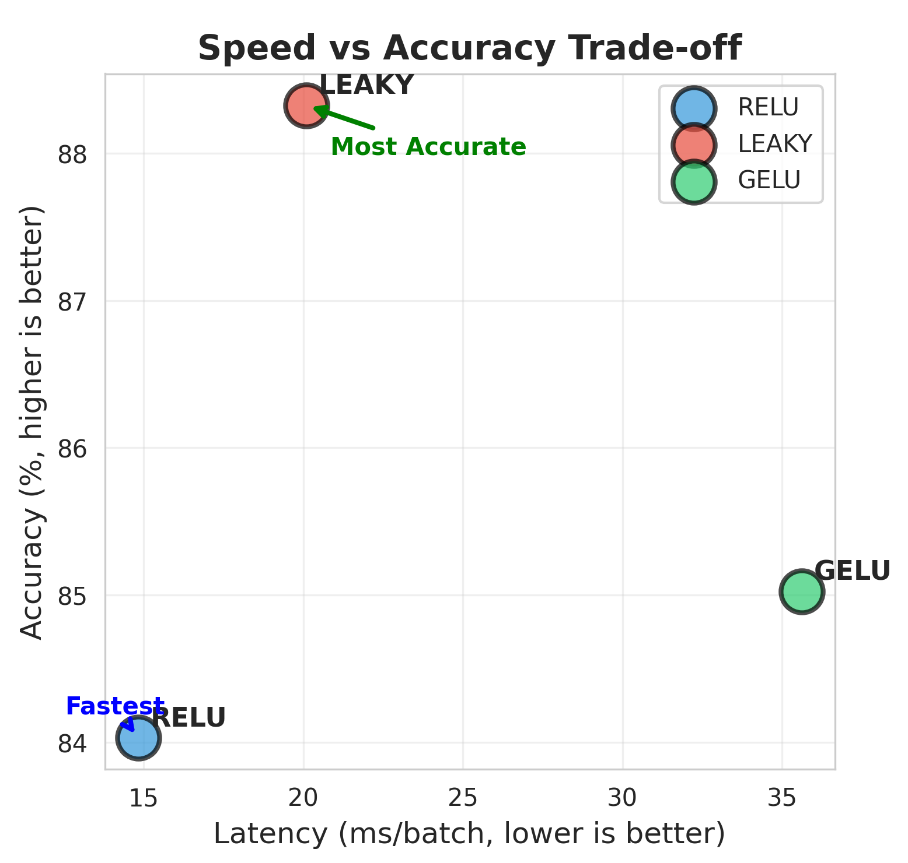
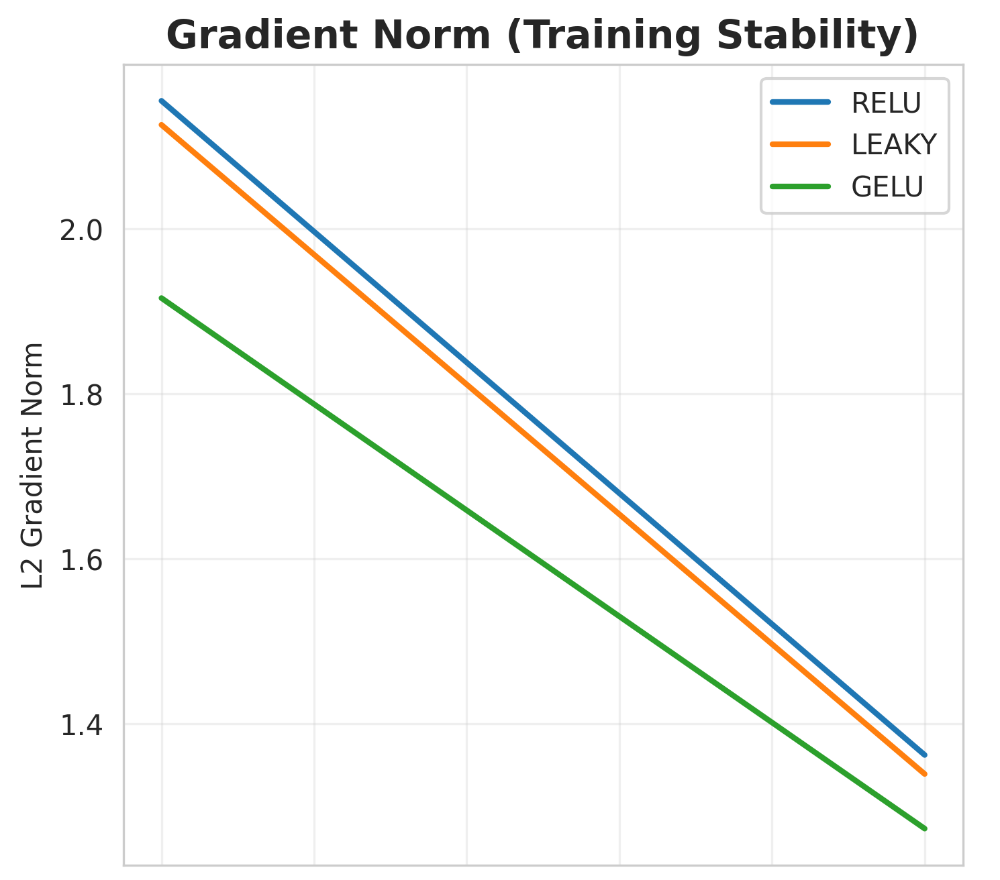

# Activation Function Ablation Study for 3D Point Cloud Classification

**Tagline:** ReLU vs Leaky ReLU vs GELU in a PointNet baseline — accuracy, stability, and latency under a fair, single-switch setup.

[](https://colab.research.google.com/drive/158JWPHH55_zEYLZ2anqLM5NEZWqmfe_3?usp=sharing)


## TL;DR

* Leaky ReLU achieved the best accuracy on ModelNet10 in this setup.
* ReLU delivered the fastest inference and is the most deployment/INT8-friendly.
* GELU (tanh approximation) trained stably but was significantly slower on this backbone.

---

## Objective

Quantify the impact of **ReLU**, **Leaky ReLU (α = 0.01)**, and **GELU (tanh approximation)** on **accuracy**, **training stability**, and **inference latency** in a PointNet classifier trained on **ModelNet10**.

---

## Results Summary

| Activation | Best Acc (%) | Latency (ms/batch) | Latency (ms/sample) | Speed vs ReLU |
| :--------- | -----------: | :----------------- | ------------------: | :------------ |
| **RELU**   |        84.03 | **14.83 ± 1.33**   |           **0.232** | **1.00×**     |
| **LEAKY**  |    **88.33** | 20.09 ± 1.12       |               0.314 | 0.74×         |
| **GELU**   |        85.02 | 35.61 ± 1.53       |               0.556 | 0.42×         |

Key takeaways:

* Accuracy winner: **Leaky ReLU** (+0.99 pp vs ReLU).
* Speed winner: **ReLU** (about 2.4× faster than GELU per batch on a T4).
* Stability: All three converge; GELU shows a slightly lower final gradient norm.

---

## Experimental Setup

* **Model:** Simplified **PointNet** with a single activation switch (applied identically in backbone and head).
* **Dataset:** **ModelNet10** (~5k CAD meshes), 1,024 points per shape (surface sampling, normalized).
* **Training:** 20 epochs, Adam (lr = 0.001), batch size 32, StepLR at epoch 20 (γ = 0.5).
* **Initialization:** **He/Kaiming** for all runs.
* **Seed:** 42 (single-seed; see Limitations).
* **Hardware:** Google Colab, Tesla T4.

Fair-comparison guarantees:

* Same activation everywhere (no mixing).
* Same initialization, seed, optimizer, schedule, and augmentations.
* Latency measured with warmup, `model.eval()`, and CUDA synchronization; both per-batch and per-sample reported.
* Dead units tracked **per-channel** (a channel counted “dead” if it never activates on the evaluation set), not element-wise sparsity.

---

## Visualizations

Include these four plots in the README (crop from your composite and save under `figs/`):

```
figs/best_accuracy.png            # bar chart: Best Test Accuracy
figs/latency_batch.png            # bar chart: Inference Latency (ms/batch, with std)
figs/speed_vs_accuracy.png        # scatter: Speed vs Accuracy trade-off
figs/gradient_norms.png           # line: Gradient Norm (training stability)
```


Embed:

```markdown




```

---

## Findings

1. **Accuracy**
   Leaky ReLU edges out ReLU and GELU here. The small negative slope maintains gradient flow for near-zero activations, which are common in sparse point features.

2. **Latency**
   ReLU is consistently fastest and fuses well in typical deployment stacks. GELU’s tanh/erf math introduces notable overhead on this backbone.

3. **Training stability**
   All three converge smoothly. Final gradient norms (lower is better) were: ReLU 1.36, Leaky 1.34, GELU 1.27.

4. **Dead units**
   With proper initialization and normalization, dead ReLUs were negligible: about 0.2% of channels never activated on the eval set. Leaky’s benefit is mainly insurance under tougher conditions (e.g., poorer inits, stronger imbalance).

---

## When to Use Which Activation

### ReLU

* **Choose for:** tight latency budgets, embedded/edge deployment, and INT8 quantization.
* **Why:** fastest, widely optimized, quantization-friendly.
* **This study:** 84.03% accuracy, 14.83 ms/batch, ≈0.232 ms/sample.

### Leaky ReLU (α = 0.01)

* **Choose for:** slight robustness boost against dead units or mild class imbalance, with a modest latency cost.
* **This study:** 88.33% accuracy, 20.09 ms/batch.

### GELU (tanh approximation)

* **Choose for:** attention/Transformer-style blocks or tasks where smooth gating helps and latency is less critical.
* **Caveat:** typically less INT8-friendly without QAT or special kernels.
* **This study:** 85.02% accuracy, 35.61 ms/batch.

---

## Reproducibility

* Single-notebook pipeline (Colab) with sections: setup → data → model (activation switch) → training → evaluation → profiling → plots.
* Save checkpoints and logs after each run.
* Warm up before timing; report both ms/batch and ms/sample with the same batch size across runs.

---

## Limitations

* **CAD vs LiDAR:** ModelNet10 meshes are CAD; results generalize directionally, not absolutely, to LiDAR perception.
* **Single seed:** Numbers can shift slightly; run three seeds for tighter confidence intervals.
* **No TensorRT in this notebook:** Deployment notes reflect common fusion/quantization behavior; measure on target hardware for final decisions.

---

## Conclusion

On this PointNet baseline and setup: **Leaky ReLU** achieved the best accuracy, **ReLU** delivered the best latency and deployability, and **GELU** was stable but slower. For real-time perception stacks, start with **ReLU**, consider **Leaky** if you observe dead-unit issues or class imbalance, and reserve **GELU** for attention-heavy modules or when latency budgets allow.
